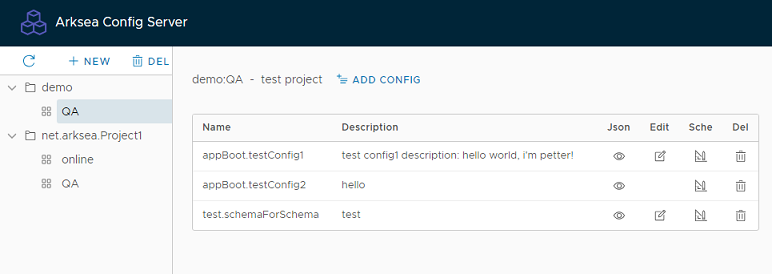
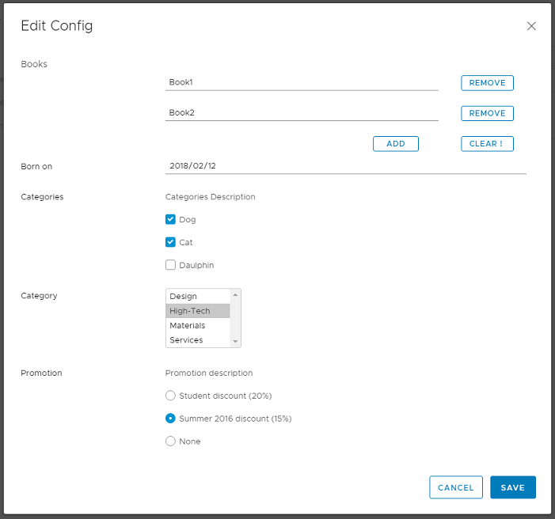
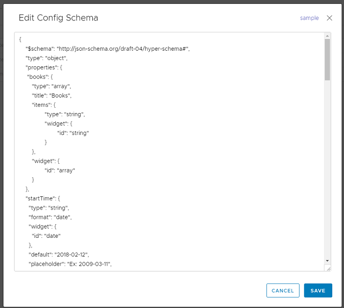
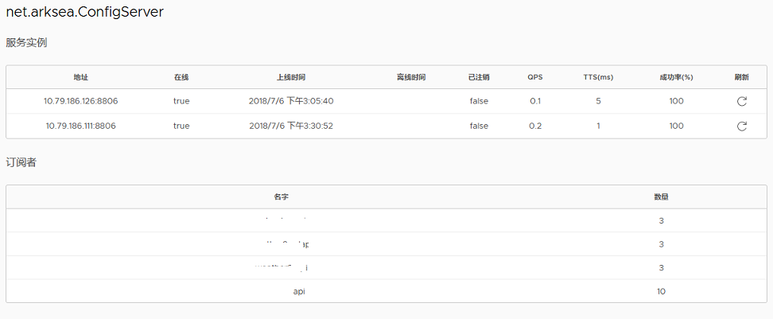

# configer
通用配置服务

  
  
## 特性
 - 缓存与数据流
```
    客户端 《──┬─ 客户端本地缓存《──┬── Configer服务缓存《── 数据库
              └─ 客户端本地文件《──┘
```
 - 通过Json Schema定制配置值表单

  | 表单 | Schema |
  | ---- | ---- |
  | | |

 - 支持多台服务集群
 
   

## 客户端使用实例

 - 指定配置服务地址

```
public static void main() {

    ConfigService configService = new ConfigService("172.17.150.87:8806", "net.arksea.TestProject", "online");
    
    String value = configService.getString("app.init.configer1");
    int num = configService.getInteger("app.init.config2");
    List list = configService.getList("app.init.config3");

}
```

 - 使用服务发现
 
```
public static void main() {
    
    Client client = registerClient.subscribe("net.arksea.ConfigServer");
    ConfigService configService = new ConfigService(client, "net.arksea.TestProject", "online", 3000, client.system);
    
    String value = configService.getString("app.init.configer1");
    int num = configService.getInteger("app.init.config2");
    List list = configService.getList("app.init.config3");

}
```
